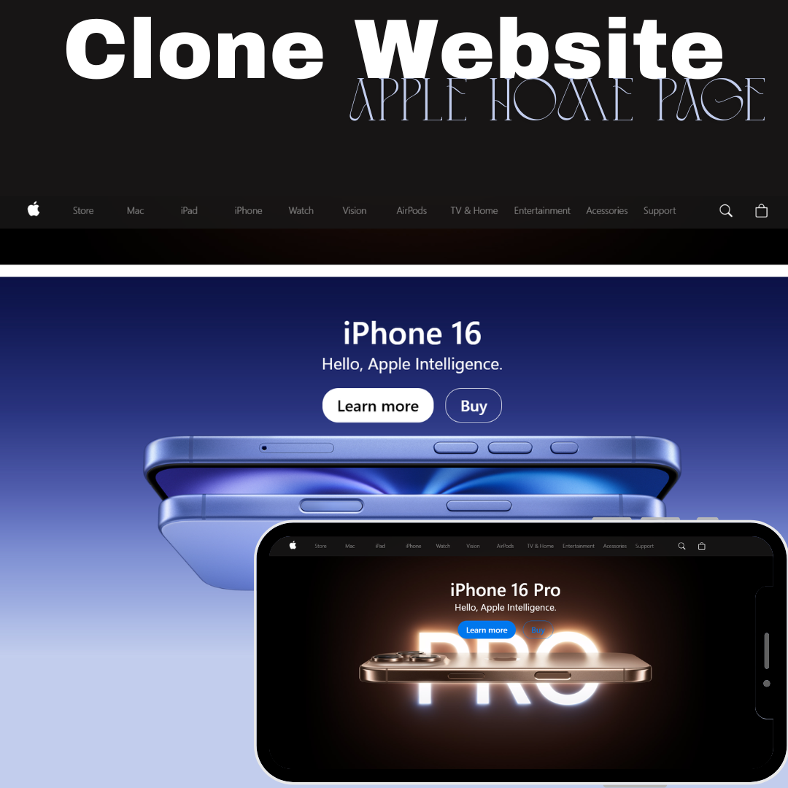

<h1 align="center">Project Apple Website</h1>

 ## 📲Acesse
 
 <strong>My contacts:</strong>
 
 [LinkedIn](https://linkedin.com/in/marianabelo26/)
  
 [Instagram](https://instagram.com/marianabelo.__)
 
<h2>My Project</h2>

<h3 align="center">Project <a href='https://marianabelo26.github.io/siteApple/' target='_blank'>Clone of the Apple Home Page</a></h3>

  

## 💻 Projeto

The Apple Website Clone is a personal project with the goal of learning the programming language React.js.

